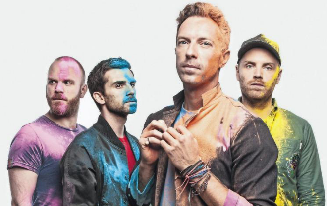
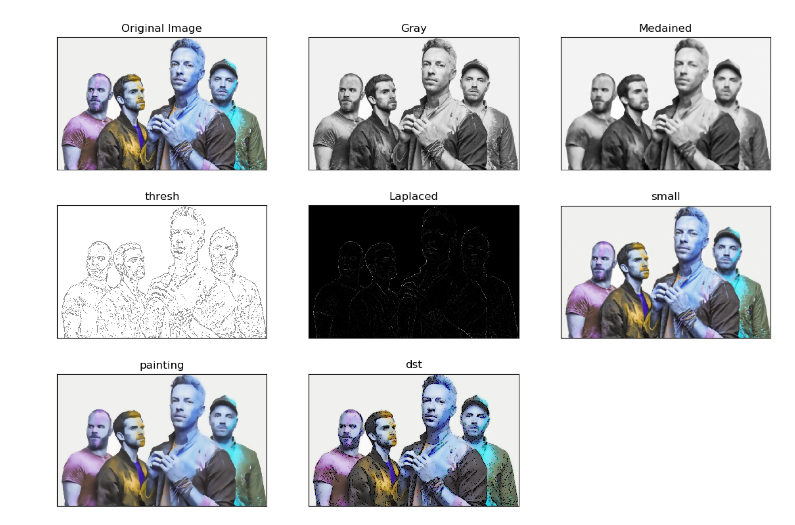
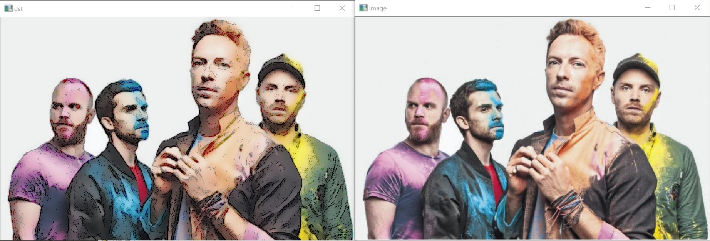

Cartoon Effect using OpenCV Python 3.x
Test Image:
Size 600x417 pixels
 

Used Libraries and Cause:

CV2 – OpenCV main functionalities.

Numpy – used for image filter calculation processes.

matplotlib.pyplot – used for plotting different results.

Steps:

1)Change coding of the read image to uint8 in order to be matched with later processes including bilateralFilter and resizing. (Mandatory)

2)Change to grayscale

3)Apply median filter with size 7 to reduce the noise (7 based on try and error/best result )

4)Apply Laplace filter using kernel size 300 (based on try/error) to show edges – using depth of 8unicode to match source image.

5)Apply threshold with minimum 5 and maximum 125 to  connect the edges appeared from laplace.

6) thresh =255-thresh
Inverted the output of the threshold to have black lines and white background to stamp it on our desired image.

7) small = cv2.resize(img, (0,0), fx=0.5, fy=0.5)
Resizing the image in order to use the bilateralFilter to half it’s vallue

8)Applying bilateralFilter to smooth the image while having sharp edges.

9)resize output back to original size 

10) add threshold image to bilateralFilter filter output with bitwise_and to get final approach.

Output :
 

Final Comparison between Image and our final output: 

